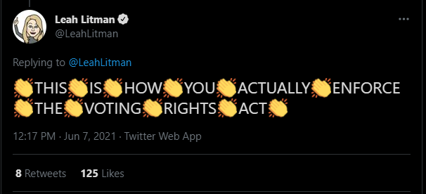
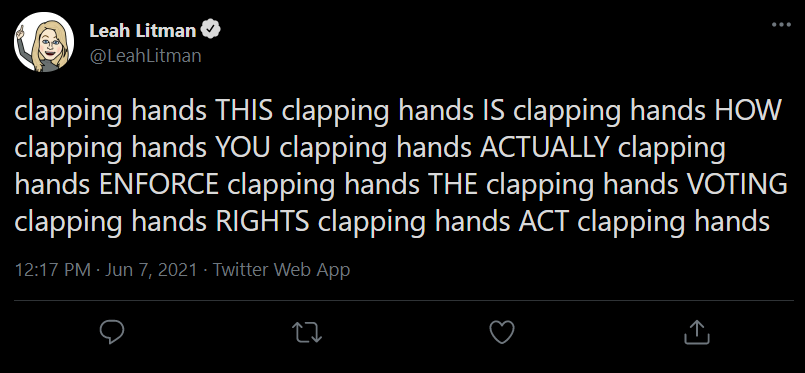
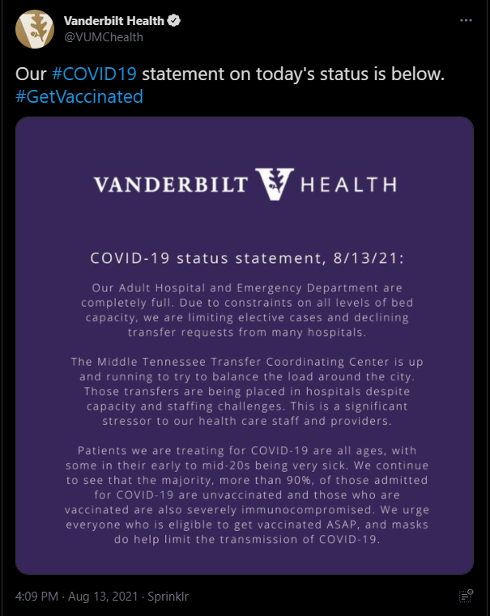
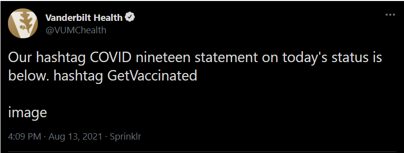

# SRTV

SRTV (Screen Reader Tweet Visualizer) is a [Twitter bot](https://twitter.com/srtvtweeter) that tweets the screen reader output of a tweet either as audio, an image, or text.

## Motivation

Accessibility is an important consideration for any website. This is especially true for a site like Twitter, where tweets can contain images and videos and entire ideas might be conveyed through emojis or GIFs.
Depending on the tweet, however, these ideas may not be properly conveyed for those that use a screen reader for tweets. 

For example, below is a tweet about enforcing the Voting Rights Act through the appointment of judges:

Notice how there is a clapping hands emoji between every word. A screen reader will read out each use of the emoji, which would look something like this:

It's hard to parse out the message between the words of the emoji, right? Now listen to that same tweet as audio, just as one with a screen reader would:

https://user-images.githubusercontent.com/10481844/129468639-e330efe2-5323-405f-b6a1-f2fcf47a6f08.mp4

This can be really grating on those using screen readers, not to mention very confusing as the message is completely lost between all of the "clapping hands" words.

But it's not just about a tweet being annoying or hard to understand. Take for example this tweet from the Vanderbilt University Medical Center:

In this tweet, the Medical Center issued a statement stating that the Adult Hospital and Medical Center is at capacity and will be limiting elective procedures and denying transfer requests from other hospitals.
However, when using a screen reader, the information received is different.

The statement in the tweet is replaced with "image", indicating that the image did not have any alt text. People who are using screen readers lose the valuable information within the statement because of this. However, the sender of the tweet may not realize how the tweet is presented to someone using a screen reader. Furthermore, the person is unlikely to constantly check tweets against a screen reader.

This is where SRTV comes in. It bridges the gap between the visual version of a tweet and the screen reader version of a tweet. It shows a tweet as it is when read through a screen reader.

## How It Works

To use SRTV, reply to a tweet or quote tweet it mentioning the SRTV bot (@srtvtweeter) with the word "render" and then a render option. SRTV will then reply with the screen reader version of the tweet text.

- TODO: add example of this

### Render Commands

SRTV has several options in rendering the screen reader output of tweets. These commands are detailed below:

#### Render Video (default)

This option renders the specified tweet into a video. The video contains the screen reader audio of the rendered tweet with captions. 

#### Render Image

This option renders the specified tweet into an image. The user also has the option of specifing either a light theme, dim theme, or a dark theme by specifing either "light", "dim", or "dark" before "image" (e.g. "render dark image"). The bot defaults to picking the dim theme.
The image also has alt text with the contents of the screen reader output, or reply tweets if the length of the alt text is loo large.

#### Render Text

This option renders the specified tweet into a text tweet. Mutliple tweets will be sent if the length of the text cannot fit in a single tweet.

#### Full Text

By default, SRTV will only render the text of a tweet. However, by specifying "full" after "render", the bot will render the following as one text:

- Name
- Screen Name
- Screen Names the tweet is replying to
- Whether the account is protected
- Whether the account is verified
- Tweet text
- Quote tweet text
- Name who retweeted tweet if applicable
- Alt text of images and gifs
- Video attribution
- Url card if available

## Screen Reader Output Caveat

Not all screen readers may have the same output from a tweet as the SRTV bot. There are many different screen readers and many different customization options for each screen reader. 
For SRTV, the following screen readers were used in testing what tweet output should be:

- NVDA
- Windows Narrator
- TalkBack

If you are noticing a completely different output from a certain screen reader than the SRTV output, feel free to open an issue about it, especially for JAWS or VoiceOver.

## Contributions

Contributions are always welcome. Read [the contributions file](CONTRIBUTING.md) for guidelines on contributing to SRTV.

